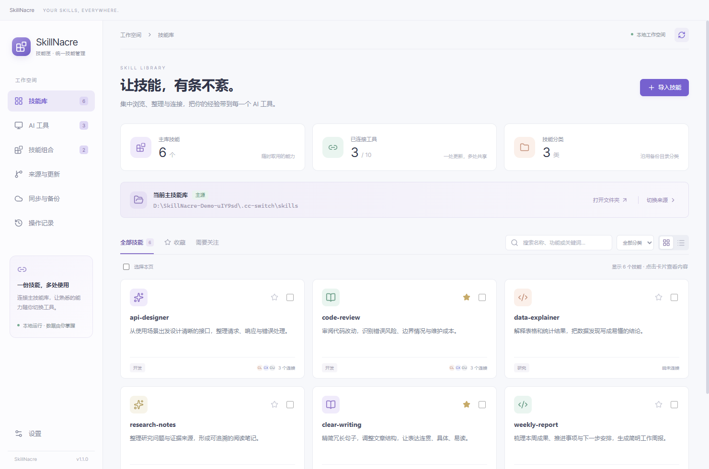
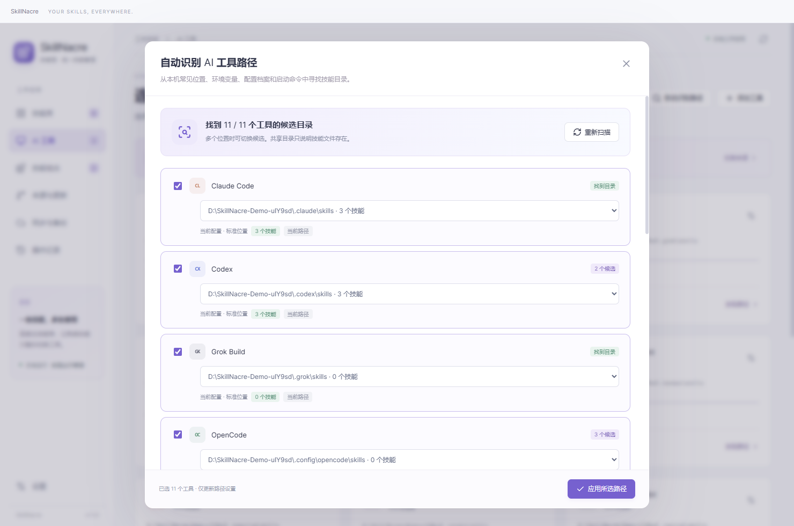
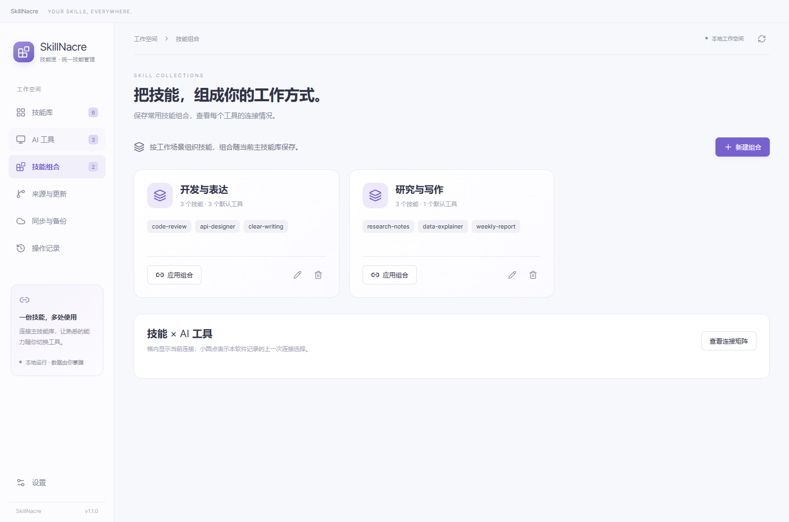

# SkillNacre · 技能匣：中文使用说明

适用版本：**1.1.0 / Windows x64**。[返回项目首页](../README.md) · [下载安装包](https://github.com/xing-skyline/skillnacre/releases/latest)

## 目录

- [一、安装与启动](#一安装与启动)
- [二、选择技能主源](#二选择技能主源)
- [三、自动识别 AI 工具路径](#三自动识别-ai-工具路径)
- [四、浏览和编辑技能](#四浏览和编辑技能)
- [五、连接与断开技能](#五连接与断开技能)
- [六、导入本地或 GitHub 技能](#六导入本地或-github-技能)
- [七、技能组合与连接矩阵](#七技能组合与连接矩阵)
- [八、同步与备份](#八同步与备份)
- [九、检查来源更新](#九检查来源更新)
- [十、操作记录与恢复](#十操作记录与恢复)
- [数据位置与迁移](#数据位置与迁移)
- [常见问题](#常见问题)

## 一、安装与启动

### 选择发行包

从本仓库 Releases 下载 `SkillNacre-Setup-1.1.0.exe`，按向导选择安装位置，之后可使用桌面快捷方式启动。也可以下载 `SkillNacre-Portable-1.1.0.exe`，双击后自动解压并启动，首次打开可能稍慢。

两种方式都不需要安装 Node.js 或 Python。便携版仍使用当前 Windows 账号的应用数据目录，配置与备份不会自动放到 EXE 旁边。

软件当前没有发布者代码签名。若 Windows 提示未知发布者，请先确认文件来自本仓库的 Releases。可以下载同页的 `SHA256SUMS.txt`，在 PowerShell 中核对：

```powershell
Get-FileHash .\SkillNacre-Setup-1.1.0.exe -Algorithm SHA256
```

将输出的 `Hash` 与校验文件中对应文件名的值比较，大小写不影响比较。

### 允许创建软链接

Windows 创建真正的目录软链接需要相应权限。通常可以在系统设置中搜索“开发者模式”，开启并完成 Windows 的确认流程，然后重新启动 SkillNacre。单位管理的设备可能由管理员限制该设置。

软件在权限不足时会显示错误并保留原条目，不会自行修改系统权限。阅读技能、搜索和路径识别可以先使用；实际连接前再解决权限问题。

## 二、选择技能主源

**主源**就是你打算统一维护技能内容的文件夹。比如已经在 Claude Code 中维护技能，可以直接把它的技能目录设为主源；已经使用 CC Switch 时，也可以选 CC Switch。主源不要求是某个固定软件。

1. 在 **技能库** 点击 **切换来源**。
2. 选择一个预置工具，或浏览指定自己的目录，例如 `D:\MySkills`。
3. 核对路径后点击 **使用此来源**。
4. 返回技能库查看技能数量与解析提示。



初次运行会把 `~/.cc-switch/skills` 作为候选。这里的 `~` 表示当前 Windows 用户的主目录，例如 `C:\Users\你的用户名`。没有该目录时，直接选择已有目录，或通过导入建立技能库即可。

切换主源只更改配置，不迁移文件，也不把旧链接自动改连到新主源。重新选好主源后，需要在技能库选择技能并执行连接。

### 可识别的技能目录

每个技能有独立文件夹，包含 `SKILL.md`；支持平铺和最多两层分类目录。例如：

```text
D:\MySkills\
├─ code-review\
│  ├─ SKILL.md
│  └─ scripts\
└─ 01-写作\
   └─ weekly-report\
      ├─ SKILL.md
      └─ references\
```

`SKILL.md` 顶部需要 YAML 格式的名称和功能描述：

```markdown
---
name: code-review
description: 阅读代码改动，检查错误风险和边界情况，并给出改进建议。
---
# 代码审阅

## 工作流程
1. 了解修改目标。
2. 检查代码和必要测试。
3. 汇总有依据的问题。
```

目录名与 `name` 应一致，使用英文字母、数字、短横线或下划线，长度不超过 128 个字符。`description` 可以使用中文。受保护目录和 Windows 保留名称不能作为技能名。

同一主源出现两个相同名称的技能时，软件会报出冲突，需要先整理目录。格式不完整时，根据界面提示修正 `SKILL.md`。隐藏目录、内置技能与插件缓存不作为普通技能接管。

如果主源中的技能本身是软链接，详情会显示实际文件位置。**编辑会修改实际源文件**，连接到其他工具时也会直接指向该实际位置。

## 三、自动识别 AI 工具路径

打开 **AI 工具 → 自动识别路径**，或 **设置 → AI 工具路径 → 自动识别路径**。

1. 等待扫描，查看每个工具的候选目录、技能数量和识别依据。
2. 有多个位置时，在该工具的下拉列表中选择实际使用的位置。
3. 勾选希望更新设置的工具。
4. 点击 **应用所选路径**。



| 界面信息 | 含义 |
| --- | --- |
| 找到目录 | 找到可用的候选位置，需要按自己的工具配置核对 |
| 多个候选 | 可能有配置档案、工作区或多个独立技能目录 |
| 共享位置 | 同一目录可能被多个工具读取，不能据此判断某个工具已安装 |
| 发现启动命令 | 在 PATH 中找到对应文件，扫描没有执行它 |
| 技能目录尚未创建 | 找到配置痕迹或启动命令，可先保存建议路径，连接时才创建目录 |
| 未发现目录 | 在设置中手动浏览指定实际位置 |

扫描会查看常见目录和环境变量；支持 Hermes profiles、OpenClaw 工作区 / 额外技能目录，以及 OpenCode 的路径配置。JSON、JSONC、JSON5 配置仅提取路径字段，其他内容不返回界面。

扫描与应用不会建立链接，也不会修改主源和备份目录。候选目录或设置在扫描后发生变化时，需要重新扫描。识别结果有效期为 10 分钟。

Codex 的新环境请按[官方说明](https://learn.chatgpt.com/docs/build-skills#where-codex-loads-local-skills)核对 `~/.agents/skills`；软件同时保留旧环境的 `.codex/skills` 候选。OpenCode 也可能读取 `.claude/skills` 和 `.agents/skills`，具体规则见[官方文档](https://opencode.ai/docs/skills/)。

需要连接其他工具或某个项目的技能目录时，可以在设置中添加自定义工具并指定路径。本版不自动遍历项目目录、整盘或 WSL 内部。

## 四、浏览和编辑技能

技能库支持按名称、功能描述和关键词搜索，也可以筛选分类、收藏及连接状态，切换卡片或列表。

点击技能后，可以阅读 Markdown 正文，切换 **源文件** 查看完整 `SKILL.md`，查看资源文件和各工具连接状态。资源预览适用于 500 KB 以内的文本文件；二进制文件可以打开所在文件夹查看。

编辑时：

1. 打开技能详情，点击 **编辑正文**。
2. 修改源文件，保留有效的 YAML 名称和描述。
3. 点击 **保存修改**。保存前软件会备份原内容。

如果文件已被编辑器或其他工具修改，保存会被拦截，重新打开最新内容后再编辑。已经连接到该技能的其他目录会看到源文件的新内容；目标 AI 工具可能仍需要刷新或开启新会话。

## 五、连接与断开技能

### 建立连接

1. 在技能库勾选一个或多个技能。
2. 点击 **连接到 AI 工具**。
3. 选择目标工具，点击 **预览操作**。
4. 查看来源、目标和动作；有需要时展开文件差异。
5. 点击确认执行，查看操作记录中的成功或失败结果。

也可以在 AI 工具页对某个工具执行连接。遇到同名目标时：

| 目标状态 | 处理方式 |
| --- | --- |
| 已正确链接 | 保持现状，无需重复修改 |
| 目标不存在 | 建立新的目录软链接 |
| 同名普通目录、错误或失效链接 | 先保存可恢复条目，再替换为正确链接 |
| 目标就是源文件所在位置 | 跳过，避免把源文件替换成指向自己的链接 |

预览有效期为 10 分钟。预览后来源、目标、设置或根目录指向发生变化，必须重新预览。每个技能的某项操作失败后，会跳过该技能后续依赖动作，其他技能可继续完成。

### 断开连接

选择相关技能与工具，使用界面的断开操作并核对预览。断开只处理指向当前主源的受管链接，不直接删除源技能，也不移走工具独立安装的技能。

若工具通过其他共享位置仍能找到同名技能，断开预览会提示剩余发现位置。想确认是否还会加载，请检查该工具的实际配置和新会话。

## 六、导入本地或 GitHub 技能

### 本地文件夹

1. 点击 **导入技能 → 本地文件夹**。
2. 选择单个技能目录，或包含多个技能及分类的上级目录。
3. 勾选需要导入的技能，预览导入内容。
4. 确认执行后，技能进入当前主源，并登记本地来源。

导入是复制，之后可通过“来源与更新”检查原目录的变化。如果导入内容包含指向目录外部的链接或内部软链接，软件会拒绝不受支持的复制；请整理为独立的技能文件包后导入。

### 公开 GitHub 仓库

先安装 Git for Windows，并确保重新启动 SkillNacre 后能够找到 `git` 命令。

1. 点击 **导入技能 → GitHub 仓库**。
2. 输入 `owner/repo` 或 `https://github.com/owner/repo`。
3. 需要时填写分支 / 标签和技能子目录；子目录填写仓库内相对路径。
4. 下载并扫描后，选择需要的技能，查看预览并确认导入。

例如仓库把技能放在 `skills/code-review` 中，就在子目录字段填写该路径。不要把 GitHub 的 `tree/...` 页面地址当作仓库地址。

软件使用 Git 下载独立快照，记录实际提交，不执行其中的脚本。网络不可用时，可以先手动下载并解压仓库，再从本地文件夹导入。本版不提供私有仓库凭据配置。

## 七、技能组合与连接矩阵

在 **技能组合** 中建立常用集合，例如“写作”“开发”或“研究”，保存技能清单与默认目标工具。之后可以编辑组合、调整工具或移除组合。

应用组合会为选中的技能追加连接，组合之外的已有技能继续保留。移除组合只删除组合定义，实际连接需单独断开。



连接矩阵按“技能 × 工具”展示当前文件系统状态，同时记录软件上次执行的连接选择。通过其他软件建立或移除的链接，以当前观测状态为准；软件不会据此猜测 AI 会话已加载哪些技能。

## 八、同步与备份

### 配置同步目录

在 **设置 → 技能与备份目录** 指定 **云端备份目录**，例如同步盘本机的 `D:\Sync\Skills`。新安装默认留空；如果显式设置了环境变量 `SKILL_SYNC_NUTSTORE_ROOT`，软件会将其作为初始值。已有保存配置继续保留。

这里操作的是本机文件。上云、下载和跨电脑同步由坚果云等客户端负责，SkillNacre 不直接连接 WebDAV 或云盘账号。

### 选择方向再执行

打开 **同步与备份**：

- **云端备份 → 主技能库**：以备份目录中的内容更新主源。
- **主技能库 → 云端备份**：把当前主源的内容保存到备份目录。

选择技能，按需选择同步后连接的工具，点击 **预览同步**。有冲突时先查看文件差异，再选择采用来源或跳过。

软件会保存成功同步的共同基线。双方都修改了同一技能，或首次比较两份不同的现有内容时，不会根据修改时间自动决定覆盖方向。选择跳过时，会跳过该技能及其依赖动作。

### 分类与严格镜像

同步保持目标中已有技能的分类位置，新技能放入 `00-待分类`。

**严格镜像**仅在完整的“云端备份 → 主技能库”同步中可用。勾选后，主源里来源已经不存在的额外技能及相关受管链接会移入恢复备份。使用前应确认选择了完整的备份来源，再逐项检查预览。

**检查一致性**只比较本机主源、备份和链接状态，不执行同步。

## 九、检查来源更新

打开 **来源与更新**，查看技能的来源位置、GitHub 提交与本地修改状态。

1. 对需要的技能执行检查更新。
2. 查看来源变化与文件差异。
3. 如果本地也有修改，明确选择采用来源或保留本地。
4. 预览更新，核对后确认执行。

更新不会在后台自动写入。检查结果有效期为 10 分钟；实际更新前会再次验证本地与来源状态。

“已有技能”表示当前没有记录可追踪的来源。重新从原目录或 GitHub 导入，可以登记来源；相同内容可以只登记来源信息。如果两边内容相同但基线过旧，界面会提供确认新基线的流程。

GitHub 更新检查会下载新的独立快照，因此需要网络和磁盘空间。本地来源移走后，应恢复该来源位置或重新导入并登记新的来源。

## 十、操作记录与恢复

覆盖、编辑、删除和替换前的条目保存在应用数据目录的 `backups` 中。打开 **操作记录**，选择对应操作，查看每项结果、目标路径和备份位置。

### 恢复到原位置

点击 **预览恢复**，比较备份与当前内容，确认后执行。恢复前的当前版本会再保存一份备份。

如果原操作之后发生了独立修改，或父目录改为指向其他位置，软件会阻止原位恢复。这时选择 **恢复到其他文件夹**，使用一个尚不存在的目标位置，先保留两份内容再自行比较。

早期记录没有完整恢复基线时，仅支持恢复副本。不要随意搬动应用数据目录中的备份，否则历史记录中的绝对路径可能失效。

### 程序异常退出后

首页出现恢复提示时，先确认另一实例没有在执行操作，再点击 **整理恢复记录**。软件会核对旧进程是否已退出，并把中断项目整理到操作记录中，不会自动覆盖当前内容。

无法确认最终状态的项目只能恢复副本。早期空锁文件无法自动验证进程；遇到这类提示时，先关闭相关旧版本，并保留整个数据目录备份后再排查。写入进行中，正常关闭窗口会暂时被阻止，请等待结果。

### 删除技能

删除前仔细核对预览中的来源和链接。软件先将相关条目移入恢复备份；默认保留云端同名副本，只有额外勾选后才同时移走。删除主源中的实际技能会影响仍然指向它的外部链接。

## 数据位置与迁移

当前版本沿用 `%APPDATA%\skilldock`。可在 **设置** 中打开应用数据目录。安装版与便携版使用相同位置。

| 文件或目录 | 用途 |
| --- | --- |
| `settings.json` | 主源、备份位置、工具路径与收藏 |
| `workspace.json` | 按主源实际路径保存组合、来源、连接选择与同步基线 |
| `history/` | 按操作分别保存的结果与恢复记录 |
| `backups/` | 编辑和替换前的内容，以及中断操作的阶段记录 |
| `downloads/` | GitHub 下载快照 |
| `operation.lock` | 写入操作的进程锁 |

这些目录可能包含自己的技能内容和私人路径，**不要直接上传到公开仓库或 Issue**。

迁移电脑时，先在软件关闭状态下备份整个应用数据目录和主源文件夹。新电脑应重新指定主源、备份及工具路径，并重新生成软链接。组合按主源实际路径区分，历史恢复也使用绝对路径，因此本版不保证搬动目录后自动迁移所有组合或恢复记录。旧备份文件可以保留并手动取回需要的内容。

## 常见问题

### 软件打开后没有技能

先检查主源是否指向包含技能文件夹的目录，再检查每个技能是否包含 `SKILL.md`、是否有有效的 `name` 和 `description`、名称是否与目录一致。分类过深或同名冲突也会影响发现。

### 自动识别找到了多个路径，该选哪个

选择自己当前 AI 工具配置实际读取的位置。对照识别依据、技能数量和工作区 / 档案标签；不确定时先在对应工具内查看配置。保存候选只改变 SkillNacre 的目标路径，不会修改 AI 工具本身的配置文件。

### 显示已连接，AI 工具却找不到技能

先查看实际链接位置是否正确，再核对工具的全局或项目技能发现规则。尝试刷新或启动新会话。SkillNacre 的“已连接”表示目录链接指向正确，不验证某次模型会话的加载结果，也不安装技能依赖。

### 断开后工具仍然能看到技能

检查断开预览中的剩余发现位置，尤其是 `.agents/skills`、`.claude/skills` 等共享入口。工具可能还有独立副本、内置技能、项目技能或会话缓存。

### 出现 EPERM、权限不足或无法创建链接

确认 Windows 允许创建软链接，检查目标是否由其他程序占用。关闭占用程序后重新预览。不要在看到失败后直接删除原目录，先查看操作记录和备份位置。

### 提示预览过期或内容已变化

关闭预览并重新生成。若同步盘或编辑器正在持续修改同一文件，等待它完成后再操作，避免依据过时的比较结果覆盖内容。

### GitHub 下载失败

确认 Git 已安装且在 PATH 中，重启 SkillNacre 后重试。检查仓库是否公开、分支 / 标签与子目录是否有效，以及网络是否能够访问 GitHub。也可以下载 ZIP、解压后从本地导入。

### 大文件为什么没有逐行差异

文本差异单文件最多 200 KB，单次文本总量约 1 MB；超过 5000 个文件会提示使用外部工具。二进制仅显示文件变化，长文可能显示较大的前后内容块。这些限制只影响预览展示。

### 如何反馈问题

前往 [Issues](https://github.com/xing-skyline/skillnacre/issues)，提供版本号、Windows 版本、操作步骤、期望结果和实际错误。截图和日志请先隐藏个人目录、仓库地址和技能正文。潜在安全问题请使用仓库的私密漏洞报告入口。
